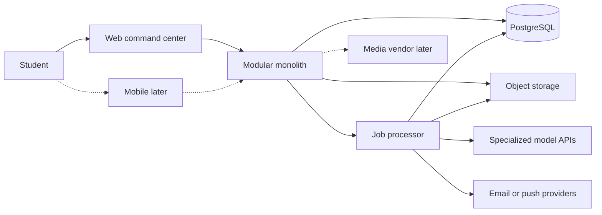
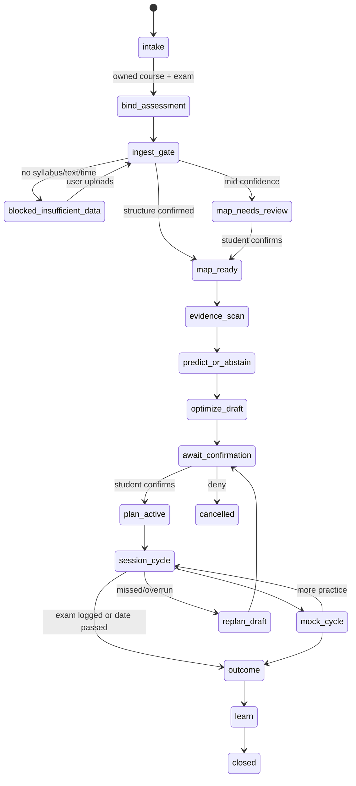
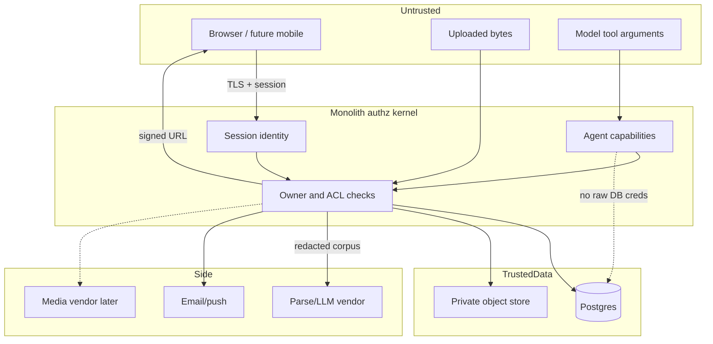
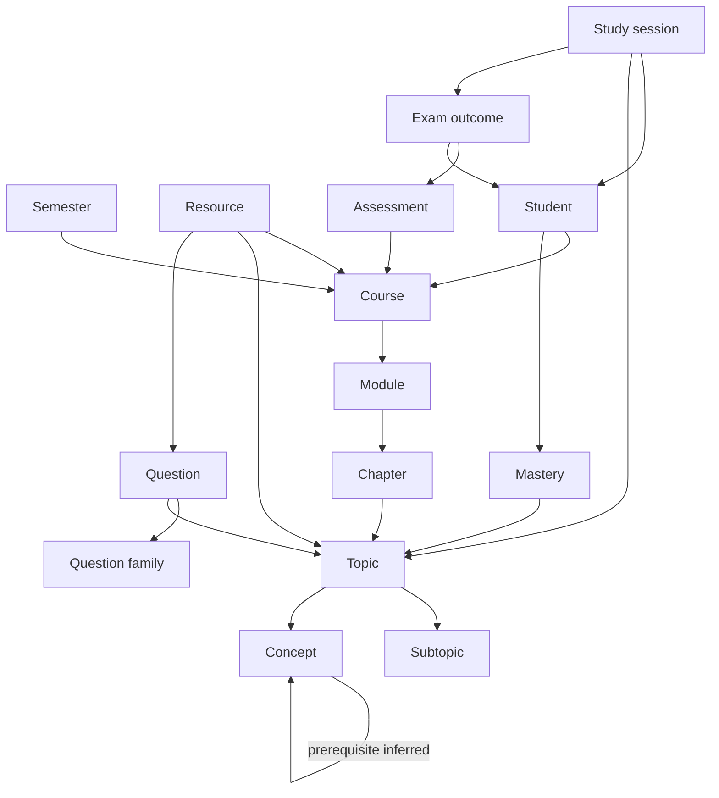
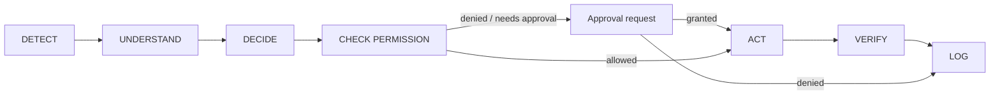
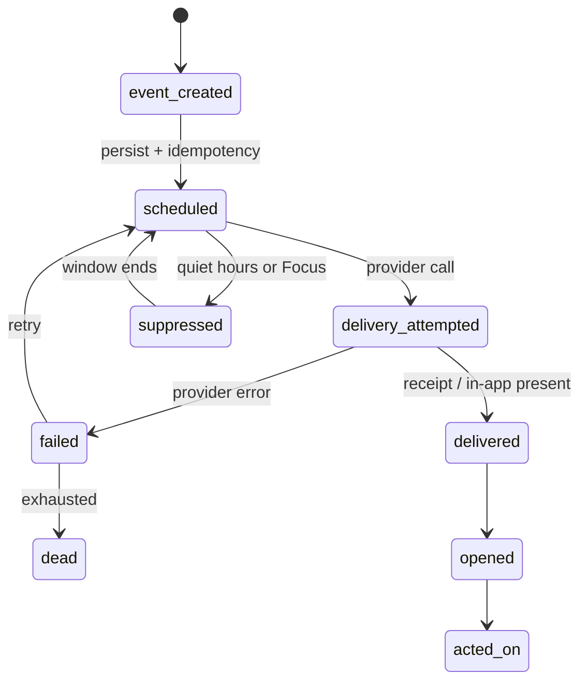

# CampusFlow Architecture

**Phase 0.** Specification only. Not production-ready. Do not scaffold from this file until decisions are frozen.

**Style:** modular **monolith** (one deployable API + web, in-process modules, one Postgres, one job table/processor). Extract services later only with a demonstrated bottleneck. **Do not** introduce Kafka, Kubernetes, a dedicated vector database, custom LLM training, or invented external integrations because the vision is large.

```
Inner ring (MVP):   identity, files, ingest, academic state, search, prep, sessions, audit, thin notify
Middle ring:        notification funnel completeness, Focus OS, mobile capture, question lab
Outer ring:         social/Flows, extra agent packages, Campus Brain, vendor A/V, official LMS
```

CampusFlow-Lite is not a dependency.

## System context



### Search Architecture: FTS FIRST

Search in MVP is strictly **PostgreSQL Full-Text Search (FTS FIRST)** on chunks.
Vector embeddings and `pgvector` index generation are **explicitly deferred to a later hybrid-search phase**.
No embeddings are required or used for the current MVP. No external vector database (Pinecone, Weaviate, Qdrant) is used or planned.

**Final MVP Search Path**:

```
document
  → extracted text
  → chunks
  → PostgreSQL FTS (tsvector/tsquery)
  → ranking
  → source citation
```

### Background Job Architecture: Transactional Outbox Pattern

- **PostgreSQL** is the single **durable source of truth** for domain state, job state (`job_outbox` table), and audit logs.
- **Redis + BullMQ** serves strictly as an **ephemeral execution transport** and worker scheduler.
- **Transactional Outbox Flow**:
  ```
  DB TRANSACTION
    → domain change
    → durable job/outbox record (`job_outbox` in PostgreSQL)
    → dispatcher (polls outbox / publishes event)
    → BullMQ (Redis execution transport)
    → worker (leases job with fencing token)
    → PostgreSQL result (status: completed/failed, audit log)
  ```
- **Durability Guarantee**: Redis is **never** treated as the authoritative record of application work. If Redis crashes or flushes, no domain asynchronous work is lost; the PostgreSQL outbox dispatcher detects undispatched or stale pending records and re-enqueues them.
- **Idempotency & Crash Recovery**: Jobs enforce unique `(queue_name, idempotency_key)` constraints in PostgreSQL. Workers lease jobs via `locked_at` and `locked_by`. Abandoned jobs from crashed workers are reclaimed by `recoverStaleRunningJobs()`.

## Resource intelligence pipeline & lifecycle

**Reconciled Resource Lifecycle**:

```
created (metadata record created in database)
  → upload_pending (signed upload URL issued)
  → uploaded (upload verified in S3 storage)
  → queued (transactional outbox job created)
  → processing (worker actively extracting text & creating chunks)
  → ready (FTS chunks indexed and verified in PostgreSQL)
  or
  → failed (extraction error; file remains downloadable, retry allowed)
```

**Course Deletion Semantics**:

- **Decision: Option A (Preserve resources with `course_id = NULL`)**.
- **Rationale**: CampusFlow is an academic second brain. Syllabi, notes, and study files represent permanent personal student assets that must never be deleted when a course container is removed or reorganized. Assessments cascade on course deletion.

Jobs are idempotent on `(resource_id, pipeline_version)`.

### Validation

- Authenticated user; ignore client `owner_id`.
- MIME allowlist (MVP: PDF, PNG, JPEG, WEBP; PPTX/DOCX later if extractors exist).
- Size cap (freeze before code; recommendation 50 MB).
- Magic-byte sniff; reject mismatch.
- Malware: content-type + size in MVP; **scanner integration SHOULD/Phase 2**. Quarantine bucket until `ready`.

### Storage

- Private object key `user_id/resource_id/object`.
- SHA-256 `content_hash`.
- Access only via **short-lived signed URLs**. Never public buckets.

### Extraction

- Text + page map. Failure → `ingest_status=failed_extract`; file still downloadable.
- Recordings: **LATER** transcription pipeline.

### Scores (not calibrated probabilities)

Store `model_score` in `[0,1]` plus `model_version`. UI copy: “model score”, never “87% chance this is Unit 3.”

| Step                             | High (≥ 0.80)                                    | Mid (0.50–0.80)                  | Low (< 0.50)              |
| -------------------------------- | ------------------------------------------------ | -------------------------------- | ------------------------- |
| Exact hash duplicate (same user) | Link to existing; skip extract                   | —                                | —                         |
| Near-duplicate                   | Suggest merge                                    | Review                           | Keep separate             |
| Course detection                 | Auto-link if unique matching course              | Suggest; review                  | Leave unassigned          |
| Topic/chapter nodes              | Create `origin=model`                            | Create `suggested`; review queue | Do not create; `Unsorted` |
| KG link                          | Link                                             | Suggested link                   | No link                   |
| Search index                     | Index extracted text always if extract succeeded |                                  |                           |

**Fallback:** original file + manual topic link always available. Never drop user bytes because the model was unsure.

**Human review:** Course workspace “Needs review” list. Blocking for auto-activate of Exam Agent map if **syllabus** failed; non-blocking for extra slides.

## Knowledge graph (architecture)

Relational tables + `graph_edge`. No Neo4j. Inferred edges have provenance. User edits set `origin=user` and win. Deep prerequisite nets and campus-level nodes are LATER. Details: [DATA_MODEL.md](./DATA_MODEL.md).

## Academic intelligence / Exam Lab

```
Analyze Papers
  → Extract Questions
  → Cluster Question Families
  → Map Topics
  → Estimate Pattern/Importance
  → Generate Mock
  → Student Solves
  → Evaluate
  → Update Mastery
  → Generate Next Mock
```

| Artifact                              | `kind`                         | Allowed claim                                     |
| ------------------------------------- | ------------------------------ | ------------------------------------------------- |
| Question text, marks, year on a paper | `observed`                     | “In these files…”                                 |
| Family cluster, frequency `n`         | `inferred`                     | “In this corpus of n papers…”                     |
| Importance score                      | `inferred`                     | Band + `n` + uncertainty; **not** “will be asked” |
| Mock item                             | `generated`                    | Practice; must cite sources                       |
| Awarded marks on eval                 | `inferred` unless rubric cited | Abstain on numeric marks if no scheme             |

**Marks/weightage:** store observed marks from papers when extraction finds them. Mocks copy weightage from families or user-set paper template. Do not invent university marking schemes.

**Exam Radar:** a **view** (coverage, date, families if any, readiness band). Not a microservice. Empty radar if no papers → show coverage only + abstain on patterns.

Relative-performance scenarios: LATER, dual consent, never default-on.

Python trainer: not in architecture until we have lawful labeled data and a reason FTS+heuristics failed.

## Agent runtime (summary)

Normative: [AGENTS.md](./AGENTS.md). One registry, one executor, packages with closed tool lists. Job rows in Postgres. Approvals as first-class rows. No agent with “access everything.”

MVP package: **Exam Agent** (covers planner + recovery **tools**). Other packages specified, not implemented.

## Notification engine

### Funnel (authoritative)

```
event_created
  → scheduled
  → delivery_attempted
  → delivered
  → opened
  → acted_on
```

Also: `suppressed` (quiet hours / Focus), `failed`, `dead`.

**Requested** = row exists (`event_created` or `scheduled`). **Delivered** = provider success **callback/receipt** for email/push, or **server-recorded inbox presentation** for in-app (client fetched the item and the server set `delivered_in_app_at`). Enqueueing a job is never delivered.

Support: idempotency keys, `dedupe_key` (e.g. one reminder per session), retries with backoff, quiet hours, Focus deferral, per-type preferences, priority (`critical|high|normal|low`), diagnostics (last error, attempt count), student-visible failed delivery.

MVP: persist funnel; send in-app and optionally email. Push tokens: Phase 2 (invalid token → `failed` + stop retry storm).

## Focus Mode

- Permission: user starts a session (web: in-app; native: OS Focus/DND prompt, degrade if denied).
- Session goal + topic/plan item + countdown.
- CampusFlow notifications with priority < `critical` stay `suppressed` until end or expiry.
- **Allowed urgent communications:** only what the **OS** break-through settings allow. CampusFlow must not claim to allow “Mom’s calls” unless using those APIs. Product may whitelist CampusFlow `critical` types (e.g. none in MVP).
- Tracking: start/end, interruptions (app events only).
- Completion summary → academic state (duration, topic, completed/skipped).
- Mastery: practice/coverage update, not a fake jump.
- Replan hook if skipped or overran.

Web Focus is MUST for MVP (timer). Native OS integration is the **stronger** layer (Phase 2).

## Social / Flows (contract, not MVP)

Objects: Friendship (bidirectional accept), Flow (course-scoped persistent contextual space), Drop (TTL thread on an entity), StudyRoom (session-scoped), HelpRequest, ShareGrant.

Messages **require** `entity_type + entity_id` (question, resource, topic, assignment, session, exam) **or** belong to a Flow/Drop that already has that binding. No unbound global DM inbox as home.

Visibility: see DATA_MODEL + PRIVACY. Moderation/block before scale.

## Voice / video (vendor boundary)

```
CampusFlow room + ACL
  → short-lived vendor tokens (server-minted)
  → media in vendor
  → optional recording → consent → Resource ingest
  → optional transcription/summary → consent, same privacy class as corpus
```

Features (later): 1:1 audio/video, group, study rooms, screen share, participant roles (`host|participant`), call-memory link.

**Do not build a media server.** If vendor is down: rooms show failed; academic data remains.

## Campus Brain (later)

Aggregate jobs over **opt-in** cohort with k-anonymity and/or differential privacy. Outputs: usefulness, difficulty, family stats, misconception tags, course patterns. Storage: aggregates only. Authorization: never student-row joins back. Product UI: “based on N opted-in students” or hide.

## Web information architecture

### Challenge and replacement

Do not ship `HOME / BRAIN / EXAMS / RESOURCES / CHAT / FLOWS / ACTIONS / CALLS` as equals.

**MVP information architecture**

| Route                 | Purpose                 | Major components                                                  | Primary action                         |
| --------------------- | ----------------------- | ----------------------------------------------------------------- | -------------------------------------- |
| **Today**             | Next loop step          | Next session, ingest failures, pending approvals, abstain banners | Start session / confirm agent / upload |
| **Courses**           | List of academic worlds | Course cards with ingest health                                   | Open course / new course               |
| **Course → Map**      | Second Brain structure  | Tree module/topic, coverage, needs-review                         | Confirm suggestions / link file        |
| **Course → Files**    | Resources               | Status, duplicates, signed preview                                | Upload                                 |
| **Course → Search**   | Grounded retrieval      | Query, citations                                                  | Open locator                           |
| **Course → Prep**     | Flagship                | Assessment binder, radar **view**, plan, mocks, sessions          | “Prepare me…”                          |
| **Course → Exam Lab** | Papers (SHOULD)         | Families, observed marks, `kind` labels                           | Generate mock                          |
| **Activity**          | Trust                   | Ingest jobs, agent runs, notification diagnostics                 | Retry / approve / deny                 |
| **Settings**          | Account                 | Quiet hours, export/delete, theme                                 | Save / export                          |

Command palette on web: jump + **Prepare me for [assessment]** (binds to owned assessments only).

**Later** add **Campus** (Flows/Drops/rooms/calls as modes). Never three social roots.

Marketing/onboarding may use Spline. **App shell must not depend on Spline.**

## Mobile information architecture (first-class product, Phase 2 build)

Optimize one-handed, thumb zone, rapid capture. Not a dense graph editor.

**Bottom navigation (5):**

1. **Today** — next session, approvals
2. **Capture** — camera, files, screenshot share-sheet
3. **Prep** — active assessment, plan, start Focus
4. **Inbox** — notifications, failed delivery
5. **You** — privacy, Focus permission, courses list (secondary)

**Quick actions (long-press Capture or Today FAB):** upload, start Focus, “Prepare me” (picks current assessment), approve last agent card.

Push: high-priority session reminders; never chat spam in MVP-of-mobile.

Chat/calls: **not** bottom-nav until Phase 3; enter from a Flow/room.

Agent approvals: full-screen cards, fail closed, no swipe-to-allow destructive.

## Design system

**Goal:** premium, technical, calm, intelligent, modern. Student-native density. Light and dark.

**Avoid:** generic purple AI gradients, heavy glass, 24px super-pills, fake analytics, card soup, motion for its own sake, WhatsApp/VTOP clones.

### Color

Semantic tokens, not raw hex in components. Recommendation:

- Light: paper background (`#F6F4F1`), ink text (`#121417`), muted (`#5C6570`), line (`#E6E1DA`)
- Dark: graphite (`#0E1114`), paper-on-dark (`#E8EAED`), line (`#1C232B`)
- **Accent (1):** deep teal `#0F6F6A` for interactive/primary (not violet)
- **Signal:** amber `#C47B17` for review/uncertainty; red `#B42318` for errors; green `#2F6B3A` for completed — used sparingly
- No neon gauges

### Typography

- UI: geometric neo-grotesk (e.g. IBM Plex Sans / Inter) with tabular lining numbers
- Academic long-form: the same family first; optional serif for printed mock previews only
- Scale: 12 / 14 / 16 / 20 / 24 / 32; course map uses 14–16, not hero marketing type in-app

### Spacing, radii, borders, shadows

- 4 px grid; page padding 16–24
- Radius 6–8 px controls; 4 px chips; **no** 999 px pill language everywhere
- 1 px borders; shadows 0–1 (light) / hairline only (dark)

### Motion

- 120–200 ms ease-out; respect `prefers-reduced-motion` (instant + opacity only)
- Command palette and Focus timer may tick; no looping background 3D

### Icons

- Lucide, 20 px default, 1.75–2 stroke, no mixed icon sets

### Charts

- Small bars/bullets for coverage; show `n` and band
- No 3D, no speedometers, no unlabeled “AI score”

### States

Every data view: empty, loading, error, **abstain/insufficient**, success. Copy tells **what to do** (upload syllabus, retry ingest).

### Notifications (UI)

Priority left-edge; failed delivery explicit; do not use unread dots as social proof.

### Command palette

`⌘K` / `Ctrl+K`: navigation, assessments, Prepare-me, pending approvals. Not a free chatbot.

### Accessibility

WCAG 2.2 AA target: contrast, focus rings, keyboard map, labels on icon buttons, live region for timer (polite), reduced motion.

### Spline

Landing, onboarding, rare brand moments. Optional later viz of the graph. **Core dashboard usable with Spline blocked.**

## Permission and security model

### AuthN

- Session after email/OAuth (vendor frozen before code).
- HttpOnly cookies + CSRF **or** bearer tokens with rotation — pick one stack.
- No university password collection.

### AuthZ

- Server-only. Client may hide buttons; API still checks.
- Object access via owner `user_id` or `resource_acl` (later).
- **All client-supplied UUIDs untrusted** — look up then authorize.
- Roles MVP: `student`. Later: no admin that can casually read PDFs; break-glass logged.
- Agents: reduced capabilities; cannot self-escalate.

### Object-level ACL (later)

`resource_acl (resource_id, grantee_user_id, perm, created_by, revoked_at)`. Default private. Flow visibility uses membership tables, not “if you know the id.”

### API validation

- Zod/equivalent on every input; file limits; pagination caps.

### Rate limiting

- Per-user ingest, agent starts, search, auth.

### Secrets

- Env/secret manager; never git.

### Signed URLs

- GET-only, TTL minutes, not guessable keys.

### File scanning

- MVP: type/size; Phase 2: malware scan before extract.

### Audit

- Authz denials, agent tools, ACL changes, export/delete, break-glass.

### Abuse

- Upload bombs, prompt injection (retrieved text is data), fake sharing links, notification storms (dedupe).

Integrity: no cheating workflows, impersonation, unauthorized submission.

## Failure modes (graceful degradation)

| Failure                     | Behavior                                                         |
| --------------------------- | ---------------------------------------------------------------- |
| PDF extraction fails        | File kept; status failed; retry; map omits                       |
| Model score low             | Review queue; Unsorted; no silent nodes                          |
| No previous papers          | Exam Lab abstains on families; coverage still works              |
| Prediction data thin        | `abstain` + `missing[]`; no invented p-values                    |
| Notification delivery fails | `failed` visible in Activity; retry policy; never mark delivered |
| Push token invalid          | Stop; ask re-permission (Phase 2)                                |
| Agent job fails             | Run `failed`; drafts only; user retry                            |
| Agent action denied         | `cancelled`; no writes                                           |
| Student misses session      | Skip recorded; replan draft; confirm if large                    |
| Database unavailable        | 503; no half-written plans (transactions)                        |
| Storage unavailable         | Upload fails clearly; no orphan DB rows (transaction/order)      |
| Realtime drops              | HTTP poll/refresh; academic data on server                       |
| Call vendor down            | Room error; no fake “connected”                                  |
| Embedding/LLM vendor down   | FTS-only search; agent abstain; ingest pause with status         |

Retries only for idempotent workers.

## Observability

- Structured JSON logs: `request_id`, `user_id` (policy), `job_id`, `agent_run_id`, `notification_id`, `prediction_id`, `model_version`, `resource_id` (not bytes).
- Metrics: ingest success/fail, search latency, agent fail/abstain/confirm, notification funnel counters, authz deny.
- Tracing: API → job → worker (one trace id).
- Error reporting: scrub PII.
- No “model accuracy” metric without labels.

**Not production-ready** until these exist in code and alerting is real.

## Flagship workflow



## Security boundary



## Knowledge graph (conceptual)



Solid product rule: **Student–Course–Resource** are ownership-explicit. Dashed-inferred in implementation via `origin`/`kind`, not a second database.

## Agent lifecycle



## Notification lifecycle



## Recommended architecture (final)

- TypeScript modular monolith: web + API together **or** `apps/web` + `apps/api` sharing `packages/domain` — freeze one.
- React + Tailwind + shadcn/ui + Motion + Lucide on web.
- PostgreSQL source of truth (graph as tables).
- Object storage for bytes.
- Postgres-backed **job queue** (or SQS later if jobs outgrow).
- FTS search first.
- One agent runtime module.
- Notification module with real funnel states.
- No Kafka/K8s/vector SaaS/custom training/media server/unofficial LMS.

## Technical risks

1. PDF quality / layout
2. Cost/latency of vendor models; prompt injection
3. Job/queue correctness (double plans)
4. Notification truthfulness
5. Scope creep into chat and radar theater
6. Authz bugs on IDs
7. Vendor lock-in (parse/LLM)
8. File malware
9. Mobile lagging web (split-brain IA)
10. Treating this spec as production readiness

## Decisions that must be frozen before coding

1. Monolith layout (single Next app vs `apps/web` + `apps/api` + `packages/*`)
2. Auth vendor
3. Host region
4. Postgres + object storage vendors
5. Job processor (recommendation: Postgres jobs)
6. Whether embeddings ship in v1 or FTS-only
7. Parse/LLM vendors + DPA
8. File types and max size
9. MVP notification channel (in-app / email / both)
10. Agent confirmation UX
11. Unused `campus_id` or omit until needed
12. Export/delete format
13. Marketing site in-repo or not
14. Size cap and malware scan vendor (or defer scan)

## Decision log

| ID  | Status   | Decision                                      |
| --- | -------- | --------------------------------------------- |
| D0  | Accepted | Spec-first; no app/scaffold this phase        |
| D1  | Accepted | Web MVP; mobile IA specified, not built       |
| D2  | Accepted | One runtime; Exam Agent implemented first     |
| D3  | Accepted | Postgres graph; no Neo4j/Kafka/K8s            |
| D4  | Accepted | No unofficial university APIs                 |
| D5  | Accepted | No social/A/V/Campus Brain in MVP             |
| D6  | Accepted | FTS in Postgres first; no dedicated vector DB |
| D7  | Accepted | Modular monolith                              |
| D8  | Proposed | Next.js + Tailwind + shadcn + Motion + Lucide |
