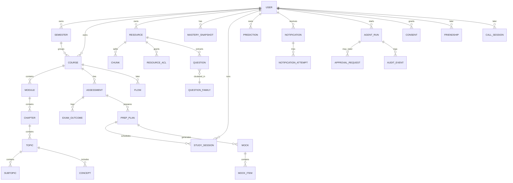

# CampusFlow Data Model

Normalized **PostgreSQL** relational model. The knowledge graph is tables + `graph_edge`, not a graph database. Schema in tests must match production via the same migrations — **no drift**.

**Ownership rule:** every student-owned row has `user_id` or a foreign key chain to an owner. Queries **join ownership**. Clients never set `user_id`.

**Authorization boundary:** enforced in the application authz kernel (and row-level policy later if needed). UI is not a boundary.

Legend: **MVP** | **SHOULD** | **LATER**

## Complete domain (ER)



## Shared conventions

- PK: `id UUID` server-generated.
- `created_at`, `updated_at` timestamptz.
- Soft delete: `deleted_at` where recovery matters; hard delete per PRIVACY.md for account closure.
- Idempotency: unique `(user_id, idempotency_key)` where writes are retryable.

---

## `users` (MVP)

|            |                                   |
| ---------- | --------------------------------- |
| Purpose    | Account                           |
| PK         | `id`                              |
| FKs        | —                                 |
| Ownership  | self                              |
| Authz      | session `user_id = id`            |
| Indexes    | unique `email` if stored          |
| Uniqueness | email                             |
| Lifecycle  | active → deleted                  |
| Deletion   | cascade personal data per PRIVACY |
| Sensitive  | email, auth ids                   |
| Audit      | login anomalies, export/delete    |

Do not store university passwords.

## `semesters` (MVP light)

|            |                                           |
| ---------- | ----------------------------------------- |
| Purpose    | Optional term grouping                    |
| PK         | `id`                                      |
| FKs        | `user_id → users`                         |
| Ownership  | user                                      |
| Authz      | owner                                     |
| Indexes    | `(user_id)`                               |
| Uniqueness | optional `(user_id, label)`               |
| Lifecycle  | user-managed                              |
| Deletion   | restrict if courses exist or null courses |
| Sensitive  | none typical                              |
| Audit      | no                                        |

## `courses` (MVP)

|            |                                   |
| ---------- | --------------------------------- |
| Purpose    | Academic container                |
| PK         | `id`                              |
| FKs        | `user_id`, optional `semester_id` |
| Ownership  | `user_id`                         |
| Authz      | owner                             |
| Indexes    | `(user_id)`, `(semester_id)`      |
| Uniqueness | none required                     |
| Lifecycle  | active / archived                 |
| Deletion   | cascade modules/topics or block   |
| Sensitive  | none                              |
| Audit      | no                                |

`institution_label` is free text, **not** an LMS key.

## `modules`, `chapters`, `topics`, `subtopics`, `concepts` (MVP: module + topic; others SHOULD/LATER)

Same pattern:

|            |                                                         |
| ---------- | ------------------------------------------------------- |
| Purpose    | Map nodes                                               |
| PK         | `id`                                                    |
| FKs        | parent + `course_id` + `user_id` denormalized for authz |
| Ownership  | course owner                                            |
| Authz      | course owner                                            |
| Indexes    | `(course_id)`, `(parent_id)`                            |
| Uniqueness | none (titles duplicate in real syllabi)                 |
| Lifecycle  | origin `user\|model`; user edit wins                    |
| Deletion   | soft; unlink resources                                  |
| Sensitive  | none                                                    |
| Audit      | model vs user origin changes optional                   |

`model_score`, `model_version` when `origin=model`.

## `graph_edge` (SHOULD/LATER for prerequisites)

`from_id`, `from_type`, `to_id`, `to_type`, `rel` (`prerequisite|related|part_of`), `origin`, `provenance_job_id`. Authz via both endpoints’ owners (must be same user in MVP). Unique `(from, to, rel)` per user.

## `resources` (MVP)

|           |                                                                                   |
| --------- | --------------------------------------------------------------------------------- |
| Purpose   | File metadata + ingest status + storage reference                                 |
| PK        | `id` UUID                                                                         |
| FKs       | `user_id` (not null, cascades on user deletion), `course_id` (nullable, set null) |
| Ownership | `user_id` (strictly authenticated session; client-supplied user ID ignored)       |
| Authz     | Owner only (private default; zero-trust access control)                           |
| Indexes   | `(user_id)`, `(course_id)`, `(user_id, object_key)`                               |
| Lifecycle | `created → upload_pending → uploaded → queued → processing → ready` or `failed`   |
| Deletion  | Cascade chunks; unlinks from course on course delete; purge S3 object on delete   |
| Sensitive | filename, storage object key, extracted text                                      |
| Audit     | upload-url mint, create, download-url mint, status change, delete                 |

### Reconciled Resource Lifecycle

```
created (metadata record created in database)
  → upload_pending (signed upload URL issued to client)
  → uploaded (file upload verified in private object storage)
  → queued (transactional outbox record created for worker)
  → processing (worker leased job: extracting text & chunking)
  → ready (text extracted, FTS chunks indexed in PostgreSQL)
  or
  → failed (extraction error; file remains downloadable, retry allowed)
```

### Exact Lifecycle & Operational Behaviors

- **Duplicate behavior**: Exact content hash matches for the same user skip re-extraction and link to existing chunk representations; near-duplicates present merge suggestions without data loss.
- **Retry behavior**: If processing transitions to `failed`, the original binary file remains safely stored in object storage. The student or system can retry ingestion without re-uploading bytes.
- **Course deletion semantics**:
  - **Explicit Decision: Option A (Preserve resources with `course_id = NULL`)**.
  - **Rationale**: CampusFlow is an academic second brain. Syllabi, lecture notes, question banks, and slides represent permanent personal student assets. Deleting a course container must **never** wipe personal files. Resources are decoupled (`course_id` set to `NULL`) and retained in the student's unassigned library.
  - In contrast, course-specific test deadlines (`assessments`) cascade on course deletion.
- **User deletion semantics**: Hard cascade. When a student deletes their account, all courses, assessments, resources, and database records are permanently deleted, and corresponding S3 storage objects are purged per PRIVACY.md.
- **Object-storage deletion**: Upload keys are strictly prefixed with `users/${user_id}/`. Deletion of a resource record enqueues an outbox job to purge the binary object from private object storage.
- **Database deletion**: Hard or soft delete strictly cleans up associated chunk rows and audit-logs the deletion event.
- **Audit behavior**: Every lifecycle event (signed upload URL issuance, creation, download URL minting, status change, deletion) emits a durable `audit_events` row.

## `job_outbox` (MVP)

|            |                                                                                      |
| ---------- | ------------------------------------------------------------------------------------ |
| Purpose    | Durable source of truth for background jobs and async operations                     |
| PK         | `id` UUID                                                                            |
| FKs        | —                                                                                    |
| Ownership  | System / tenant-bound in payload                                                     |
| Authz      | Internal job dispatcher and worker execution only                                    |
| Indexes    | `(status, scheduled_at)`, `(queue_name, idempotency_key)` UNIQUE, `(locked_at)`      |
| Uniqueness | `(queue_name, idempotency_key)` prevents duplicate job generation                    |
| Lifecycle  | `pending → dispatched → running → completed` or `failed`                             |
| Deletion   | Retained for audit/observability; periodic purge of old completed records (>30 days) |
| Sensitive  | Payloads must never contain cleartext credentials or raw file bytes                  |
| Audit      | Job dispatch, worker lease, completions, and terminal failures logged                |

### Outbox Operational Guarantees

- **Ownership of Job State**: PostgreSQL is the single durable system of record. Redis/BullMQ is purely execution transport.
- **Atomicity**: The domain table write and the `job_outbox` insert occur within the same PostgreSQL transaction.
- **Idempotency**: Enforced by the database unique constraint on `(queue_name, idempotency_key)`.
- **Worker Crash Recovery**: Workers lease jobs by setting `locked_at` and `locked_by`. Stale leases (>5 minutes) are swept by `recoverStaleRunningJobs()` and reset to `pending`.
- **Retry with Exponential Backoff**: Failures increment `attempts` and back off `scheduled_at = now + 2^attempts seconds`. Exceeding `max_attempts` marks status `failed` (poison pill protection).

## `resource_versions` (MVP)

Immutable extract snapshot: `resource_id`, `pipeline_version`, `extract_status`. Citations pin version.

## `chunks` (MVP)

|            |                                      |
| ---------- | ------------------------------------ |
| Purpose    | Retrieval unit                       |
| PK         | `id`                                 |
| FKs        | `resource_id`, `resource_version_id` |
| Ownership  | via resource                         |
| Authz      | resource authz                       |
| Indexes    | FTS on `body`; `(resource_id)`       |
| Uniqueness | `(resource_version_id, loc_ordinal)` |
| Lifecycle  | replace on re-extract                |
| Deletion   | with resource                        |
| Sensitive  | academic text                        |
| Audit      | no                                   |

`loc_page`, `heading_path`. Optional `embedding` **later** in same DB.

## `ingest_jobs` (MVP)

`resource_id`, `pipeline_version`, `idempotency_key` unique, `status`, `error_code`. Retry-safe. Authz via resource.

## `resource_acl` (LATER)

`resource_id`, `grantee_user_id`, `perm` (`read`), `created_by`, `revoked_at`. Unique active grant. Authz: owner manages; grantee read-only. Audit: grant/revoke. **Private default = no rows.**

## `questions` (SHOULD)

Extracted from papers/banks. FKs: `resource_id`, `user_id`, optional `topic_id`. Fields: `body`, `observed_marks`, `observed_year`, `kind=observed`. Authz: owner. Deletion with resource.

## `question_families` (SHOULD)

Cluster label, `method`, `model_version`, `n_questions`, `user_id`. **Descriptive of this user’s corpus.** Not campus-wide.

## `question_family_members` (SHOULD)

`(family_id, question_id)` unique.

## `assessments` (MVP)

FK `course_id`, `user_id`. `name`, `starts_at`, `kind`. Authz: owner. Unique not required.

## `prep_plans` (MVP)

FK `assessment_id`. `status` `draft\|active\|superseded`. Unique `(user_id, idempotency_key)`. Activating supersedes previous active for that assessment. Completed sessions **not** deleted.

## `plan_items` / `study_sessions` (MVP)

FK plan, topics, `starts_at`, `ends_at`, `status` `planned\|started\|completed\|skipped\|cancelled`. Focus fields: `goal`, `focus_started_at`. Authz: owner. Outcome notes optional.

## `mocks` / `mock_items` (MVP)

Mock belongs to plan/assessment. **Constraint:** `mock_items` must have ≥1 `mock_item_citations (mock_item_id, chunk_id)` or insert fails. `kind=generated`. Weightage optional from family/template.

## `answers` / `evaluations` (LATER / SHOULD)

Student response; evaluation stores marks only if rubric/scheme cited; else qualitative + `abstain_marks`. `prediction`/`evaluation` rows require evidence fields.

## `mastery_snapshots` (SHOULD)

`(user_id, topic_id, created_at)`. Evidence jsonb: coverage, practice_count, last_practiced_at, `abstain_reason`. Band enum. Not a calibrated probability. Authz: owner. Append-only.

## `exam_outcomes` (SHOULD)

Student-logged result for `assessment_id`. Highly sensitive. Authz: owner. Never in aggregates without consent pipeline. Optional.

## `predictions` (SHOULD)

Probabilistic outputs: `kind` `observed\|inferred\|generated`, `evidence_refs`, `sample_size`, `uncertainty`, `model_version`, `created_at`, `subject_type/id`. Authz: owner. Invalid without those fields.

## `notifications` (MVP)

`user_id`, `type`, `priority`, `dedupe_key` unique where not null, `idempotency_key`, `state`, `entity_type/id`, `quiet_hours_applied`, `focus_suppressed`. Authz: recipient. Sensitive: body (may include course names).

## `notification_attempts` (MVP)

FK notification. `provider`, `provider_message_id`, `result`, `error`, `attempted_at`. **Delivered** only per ARCHITECTURE definition.

## `device_tokens` (LATER)

Push tokens. Invalid token flag. Delete with user.

## `agent_runs` (MVP)

`user_id`, `package_id` (e.g. `exam`), `goal_entity`, `status`, `budget` snapshots, `idempotency_key`. Authz: owner read.

## `approval_requests` (MVP)

FK `agent_run_id`. `capability`, `payload_hash`, `status` `pending\|granted\|denied\|expired`. Authz: owner. Audit required.

## `audit_events` (MVP)

`actor_user_id`, `agent_run_id`, `tool`, `permission_result`, `entity_refs`, payload hashes. User-visible subset. Retention: PRIVACY. Append-only.

## `consents` (MVP for ToS version; LATER types)

`user_id`, `type` (`tos\|privacy\|share\|compare\|training\|call_record\|campus_brain`), `granted_at`, `revoked_at`, `version`. Authz: owner. Audit grant/revoke.

## `friendships` (LATER)

`requester_id`, `addressee_id`, `status`. Unique pair. Does **not** grant resource access.

## `flows`, `flow_members`, `drops`, `messages` (LATER)

Flow: `course_id` of **host**; members explicit. Messages: `author_id`, `visibility` via parent, **required** `entity_type/id` or parent Drop/Flow binding. Indexes `(thread_id, created_at)`. Deletion: tombstone + media purge. Authz: membership. **No** “if you have the UUID you can read.”

## `help_requests`, `match_profiles` (LATER)

Consent-gated. No silent friend graph mining.

## `call_sessions`, `call_participants` (LATER)

Vendor id, room ACL, `recording_consent` per participant. Metadata only in CampusFlow. Media in vendor. Authz: participants. Sensitive: titles, participant lists.

## `campus_aggregates` (LATER)

No `user_id`. k-anon fields, `n`, window, `model_version`. Authz: separate; never join to student rows.

## Isolation matrix

| Surface          | Who can read              |
| ---------------- | ------------------------- |
| Private resource | Owner                     |
| Shared resource  | Owner + unrevoked ACL     |
| Flow message     | Flow members              |
| Drop             | Drop members until TTL    |
| Friend list      | The two users             |
| Notification     | Recipient                 |
| Agent audit      | Owner (+ break-glass ops) |
| Aggregate        | Non-identifying only      |
| Call metadata    | Participants              |

Cross-user isolation tests are mandatory: IDOR on every entity type.

## Invariants

1. No client-set `user_id`.
2. Model nodes have provenance.
3. Mock items cite same-user chunks.
4. Predictions have evidence + uncertainty + model_version + timestamp.
5. Hash duplicate per user does not double-ingest.
6. Aggregates cannot reverse to users.
7. Same migrations in all environments.

## Refuse to model

University session cookies, scraped LMS ids as identity, public “campus question bank” from private papers, peer ranks without consent.
